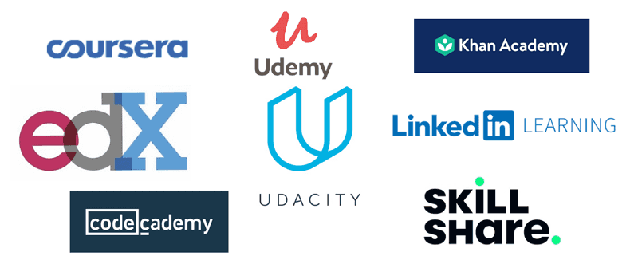
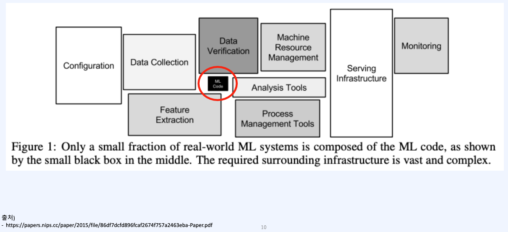
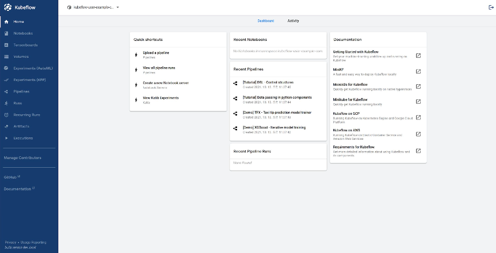

## Data Engineering & MLOps Project

최근 새로운 프로젝트를 시작하고 싶어 여러 아이디어를 생각하다가 머신러닝을 활용한 패션 관련 애플리케이션을 개발해보기로 했다. 이와 관련해서 관련 지식을 찾아보기 위해 대규모 데이터 분석 및 처리와 머신러닝에 관한 다양한 강의를 찾아듣기 시작했다. 아마 사람들이 생각할 수 있는 플랫폼의 강의는 다 찾아봤던 것 같다. Udemy, Coursera, Oreilly, LinkedIn Learning, 그리고 회사에서 제공하는 교육 플랫폼까지 찾아보면서 가장 "효과적이고 빠른" 학습을 위한 커리큘럼을 찾기 위해 거의 2주를 강의를 찾아보고 들어본 거 같다. 이 과정에서 가장 힘들었던 점은 머신러닝의 모델과 이에 특화된 애플리케이션은 기존의 웹앱과 꽤나 다른 개발 프로세스를 가지고 있으며, 이를 지원하는 툴이 너무나도 다양하게 시장에 나와있어 이를 하나하나 찾아보는 것에서 굉장한 스트레스를 받게 된다는 점이다. 특히 전체적인 관점에서 파이프라인을 만들고자 하는 나의 입장에서는 이 과정이 너무나도 귀찮고 힘든 일이었다.

그러던 중 패스트 캠퍼스에서 다음 두 강의를 찾아냈다.
- 머신러닝 서비스 구축을 위한 실전 MLOps
- 한 번에 끝내는 데이터 엔지니어링 초격차 패키지 Online

두 강의의 가장 매력적인 점은 대용량 데이터를 분석하고 처리하며, 이를 머신러닝 모델에 적용하는 프로세스를 전반적으로 확인할 수 있으며, 이 프로세스에 필요한 툴을 배울 수 있다는 점이었다. 11월 초부터 약 3주간 두 강의를 들으면서 그동안 내게 필요한 프로세스와 그에 필요한 툴이 어떤 것인지에 대해 정확히 배울 수 있었다.

 

두 강의의 공통적인 아쉬운 점은 강의가 프로세스와 툴을 소개하는 데에 집중하여 이들이 어떻게 하나의 프로젝트에서 유기적으로 사용되는 지 보여주지 못했다는 점이다. 하지만 어차피 프로젝트는 사용자가 활용하고자 하는 데이터와 모델에 따라, 사용 케이스에 따라 너무나도 다르기 때문에 이는 강의를 듣고 난 후의 과제로 생각한다면 납득이 가는 점이다. 따라서 하나의 프로젝트를 유기적으로 개발하고자 하는 사람들에게는 추천하지 않지만, 전체적인 프로세스와 이에 적용되는 툴을 배우고 싶은 나와 같은 사람들에게는 적극 추천한다.

앞으로 강의의 실습을 하나씩 다시 따라하면서 다시 한 번 툴을 학습하고 이를 활용한 파이프라인을 배포하는 것을 목표로 할 예정이다. 가장 처음 도전해 볼 것은 minikube를 설치하고 kubeflow로 파이프라인을 만들어보는 것이다. 굉장히 기대가 된다.

 

본 게시물은 패스트캠퍼스 수강 후기 이벤트 참여를 위해 작성되었습니다